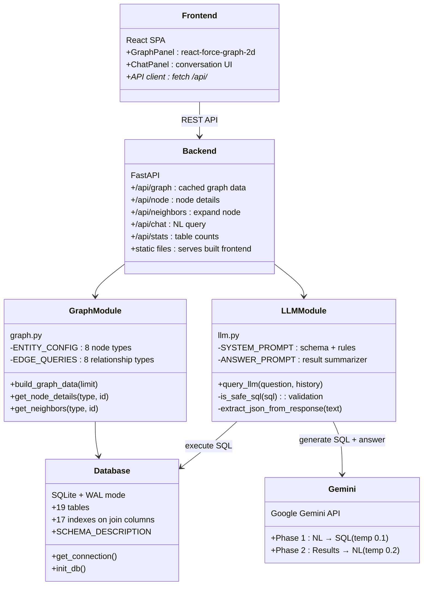
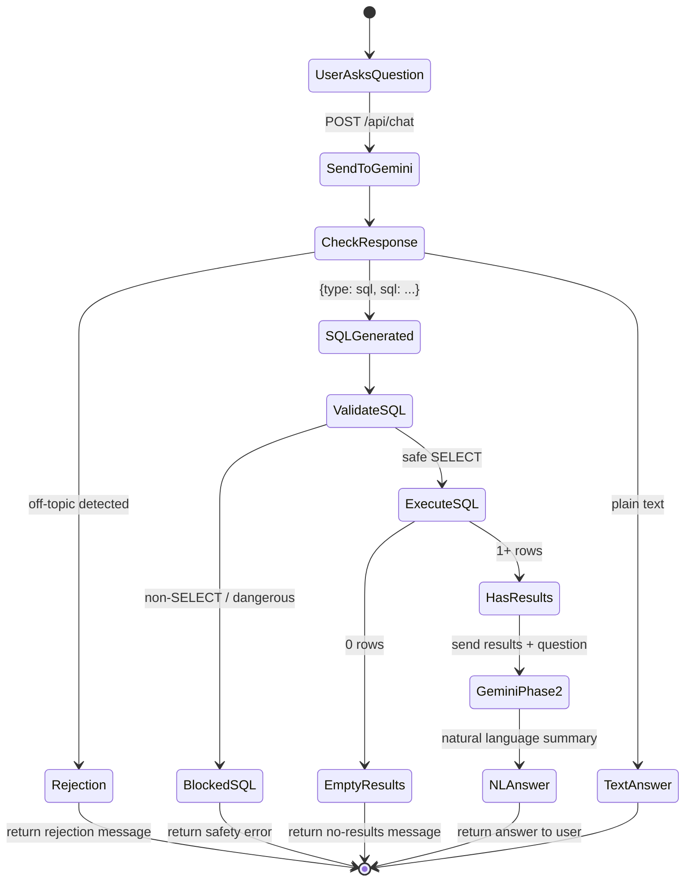
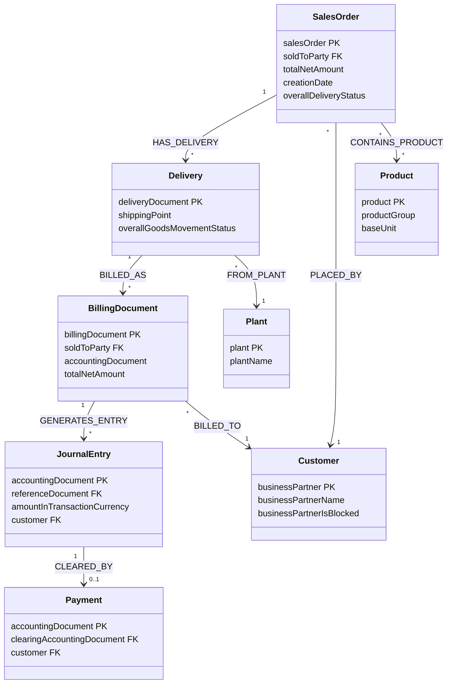

# SAP Order-to-Cash Graph Explorer

A graph-based data modeling and natural language query system for SAP Order-to-Cash (O2C) data. Users explore interconnected business entities visually and query the data conversationally — the system translates natural language into SQL via Google Gemini, executes it, and returns data-backed answers.

---

## Architecture Overview



---

## NL-to-SQL Query Flow



---

## Graph Data Model



### Relationship Join Logic

| Relationship | Join Path |
|-------------|-----------|
| HAS_DELIVERY | `outbound_delivery_items.referenceSdDocument = sales_order_items.salesOrder` |
| BILLED_AS | `billing_document_items.referenceSdDocument = outbound_delivery_headers.deliveryDocument` |
| GENERATES_ENTRY | `journal_entry_items.referenceDocument = billing_document_headers.billingDocument` |
| CLEARED_BY | `payments.clearingAccountingDocument = journal_entry_items.accountingDocument` |
| PLACED_BY | `sales_order_headers.soldToParty = business_partners.businessPartner` |
| CONTAINS_PRODUCT | `sales_order_items.material = products.product` |
| FROM_PLANT | `outbound_delivery_items.plant = plants.plant` |
| BILLED_TO | `billing_document_headers.soldToParty = business_partners.businessPartner` |

---

## Tech Stack

| Layer | Technology | Rationale |
|-------|-----------|-----------|
| Frontend | React + react-force-graph-2d | Canvas-based graph handles hundreds of nodes smoothly |
| Backend | Python FastAPI | Auto-generated docs, fast JSON serialization |
| Database | SQLite (WAL mode) | Zero-config, single file, sub-ms queries with indexes |
| LLM | Google Gemini (free tier) | Strong SQL generation, structured JSON output |
| Build | Vite | Fast dev HMR, optimized production builds |

**Why SQLite over Neo4j?** The O2C dataset has clear relational foreign keys — SQL JOINs handle traversals efficiently. NL-to-SQL is well-studied with high LLM accuracy; NL-to-Cypher is less reliable. SQLite needs zero infrastructure.

---

## LLM Prompting Strategy

**Two-phase approach** with separated concerns:

| Phase | Purpose | Temperature | Input | Output |
|-------|---------|-------------|-------|--------|
| 1 | NL → SQL | 0.1 (deterministic) | Question + full 19-table schema | `{type: "sql", sql: "SELECT..."}` |
| 2 | Results → NL | 0.2 (fluent) | Question + SQL + result rows | Natural language summary |

**Key decisions:**
- **Schema-in-prompt** (~2K tokens) — full schema in system prompt gives Gemini complete JOIN context without RAG retrieval errors
- **Structured JSON output** — reliable parsing vs free-text SQL extraction
- **Explicit O2C flow path** in prompt — the cross-table join chain (SO → Delivery → Billing → JE → Payment) is non-obvious and documented

---

## Guardrails

| Layer | Mechanism |
|-------|-----------|
| LLM System Prompt | Instructs Gemini to return `{type: "rejection"}` for off-topic queries |
| Keyword Detection | Fallback catches common off-topic patterns (weather, jokes, code, etc.) |
| SQL Validation | Regex blocks INSERT/UPDATE/DELETE/DROP/ALTER/TRUNCATE; only SELECT allowed |
| Multi-statement Block | Queries with multiple semicolons rejected |
| Result Limits | LIMIT 50 (prompt), max 100 rows to LLM, max 50 to frontend |

---

## Optional Extensions Implemented

### 1. Natural Language to SQL Translation
Two-phase Gemini pipeline: user question → SQL generation (temp 0.1) → validation → execution → result summarization (temp 0.2). The generated SQL is stored server-side but only the natural language answer is shown to the user.

### 2. Conversation Memory
Last 6 turns of chat history are sent to Gemini with each request, enabling follow-up questions like "What about their billing documents?" after asking about a specific customer. Memory is session-scoped (browser state).

---

## Project Structure

```
GraphMind/
├── backend/
│   ├── app/
│   │   ├── main.py            # FastAPI routes, graph cache, startup
│   │   ├── database.py         # Schema, connection, SCHEMA_DESCRIPTION
│   │   ├── ingest.py           # JSONL → SQLite batch loader
│   │   ├── graph.py            # Node/edge construction, neighbor queries
│   │   ├── llm.py              # Gemini NL-to-SQL, guardrails
│   │   └── schema.py           # Pydantic models
│   ├── requirements.txt
│   └── .env
├── frontend/
│   ├── src/
│   │   ├── App.jsx             # Graph + chat panels
│   │   ├── api.js              # REST client
│   │   ├── index.css           # Dark theme
│   │   └── main.jsx            # Entry point
│   ├── index.html
│   ├── vite.config.js
│   └── package.json
├── sap-order-to-cash-dataset/  # Source JSONL data
├── build.sh                    # Render build script
├── start.sh                    # Render start script
├── render.yaml                 # Render deployment blueprint
├── run_server.py               # Local dev launcher
└── README.md
```

---

## Setup & Run

### Prerequisites

- Python 3.10+
- Node.js 18+
- [Google Gemini API key](https://ai.google.dev) (free tier)

### Quick Start (Local)

```bash
# 1. Clone and enter the project
git clone https://github.com/Sajalg364/GraphMind.git
cd GraphMind

# 2. Backend setup
cd backend
pip install -r requirements.txt
echo "GEMINI_API_KEY=your_key_here" > .env   # set your key
python -m app.ingest                          # load data into SQLite
cd ..

# 3. Start backend
python run_server.py                          # runs on http://localhost:8000

# 4. Frontend setup (new terminal)
cd frontend
npm install
npm run dev                                   # runs on http://localhost:5173
```

Open **http://localhost:5173** — graph loads on the left, chat on the right.

### Deploy to Render

1. Push to a public GitHub repo
2. Go to [render.com](https://render.com) → New → Web Service → connect repo
3. Render detects `render.yaml` automatically, or set manually:
   - **Build:** `bash build.sh`
   - **Start:** `bash start.sh`
4. Add env var: `GEMINI_API_KEY` = your key
5. Deploy — get a `https://xxx.onrender.com` URL

---

## Example Queries

| Query | What it does |
|-------|-------------|
| "Which products have the most billing documents?" | Joins billing items with products, counts and ranks |
| "Trace billing document 90504248" | Follows the full O2C chain for a specific document |
| "Sales orders delivered but not billed" | LEFT JOINs deliveries and billing to find gaps |
| "Top 5 customers by total order value" | Aggregates orders by customer |
| "Show payments for customer 310000108" | Joins payments with business partners |
